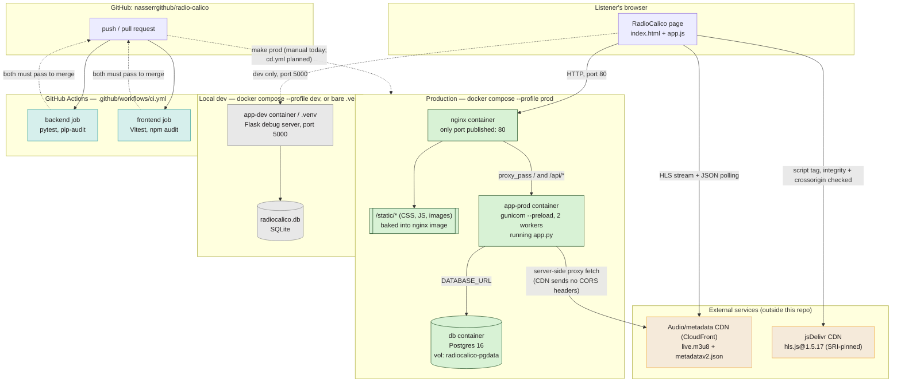

# RadioCalico: Architecture, From Zero

This is a plain-language walkthrough of every infrastructure decision behind
RadioCalico, written for someone with no prior Docker/CI/nginx experience.
It follows the actual order these pieces were added to the repo (check `git
log --oneline --reverse` if you want to see the real commit sequence), so
it doubles as "how would I build this myself, one concept at a time."

If you just want to run the app, see [README.md](README.md). This file
explains *why* each piece exists.

## System architecture diagram

Everything below in one picture: the browser, the two CDNs it talks to
directly, the production Docker stack (nginx/gunicorn/Postgres), the local
dev setup, and the GitHub Actions CI pipeline that gates merges to
`master`. Solid arrows are requests that happen on every page load;
dashed arrows are dev-only or CI/deploy-time paths.



A few things this diagram makes explicit that are easy to miss reading the
config files one at a time:

- **Only nginx is reachable from outside Docker in prod** — `app-prod`
  `expose`s port 5000 to other containers on the same Docker network, but
  nothing publishes it to the host, so there is exactly one public entry
  point.
- **The browser talks to two different third parties directly**, neither
  of which is this project's own infrastructure: the audio/metadata CDN
  (for the stream itself) and jsDelivr (for the hls.js library). Both
  connections get a browser-side integrity guarantee — CORS headers don't
  apply to `app.py`'s server-side proxy calls, but the `hls.js` `<script>`
  tag is protected by SRI (§7) since that request *does* come straight
  from the browser.
- **CI gates the merge, not the deploy** — a green `backend`/`frontend`
  job is what allows a PR to merge into `master`; nothing currently
  triggers automatically *after* that merge (the dashed line into `Prod`
  is today's manual `make prod`, not a real CD step — see §6).

## 1. The app itself, before any of this

At its core RadioCalico is a Python web server (Flask) that:

1. Renders one HTML page (`templates/index.html`) with an embedded audio
   player.
2. Talks to an external CDN for "now playing" metadata and the actual audio
   stream.
3. Lets people vote a track up or down, saving that vote to a small
   database (SQLite).

You can run this with a single command — `.venv/bin/python app.py` — and
that's genuinely enough for one person to use on their own laptop. Almost
everything described below exists to answer questions that only come up
once *other people* need to run this reliably, safely, and repeatedly:

- "How do I make sure it runs the same way on a teammate's machine as on
  mine?" → **Docker**
- "How do I make sure a change I push doesn't quietly break the app?" →
  **automated tests + CI**
- "How do I know a dependency I'm using doesn't have a known security hole?"
  → **dependency vulnerability scanning**
- "How do I run this for real users, not just myself?" → **gunicorn +
  nginx + Postgres**
- "How do I make sure a file I load from someone else's server hasn't been
  tampered with?" → **Subresource Integrity (SRI)**

The rest of this document goes through those one at a time.

## 2. Version control and local setup

Nothing exotic here, but worth stating because everything else builds on
it: the code lives in a git repository, hosted on GitHub
(`nasserrgithub/radio-calico`). Changes are made on a branch, opened as a
pull request (PR), and merged into `master` once CI passes (see §6).

Locally, dependencies are isolated in a Python **virtual environment**
(`.venv`) rather than installed system-wide — this is what `python3 -m venv
.venv` + `.venv/bin/pip install -r requirements.txt` does in the README.
A venv is just a private folder of Python packages scoped to this one
project, so RadioCalico's Flask version can't clash with some other
project's different Flask version on the same machine.

## 3. Automated tests

Before touching Docker or CI, the project needed a way to check "did I
break anything?" without manually clicking through the UI every time.

- **Backend**: `pytest` (`tests/`) drives Flask's built-in test client
  against a temporary SQLite database, exercising `/api/nowplaying` and
  `/api/ratings`.
- **Frontend**: `Vitest` unit-tests `static/js/ratings.js` — the pure
  logic (which track is "current", whether a vote should be resubmitted)
  extracted out of the DOM-wiring code so it can be tested without a
  browser.

These are what CI (§6) actually runs on every push.

## 4. Docker: making "it works on my machine" someone else's problem too

**What Docker is, in one paragraph:** a container is a lightweight,
self-contained bundle of an application plus everything it needs to run
(Python interpreter, installed packages, config) — but *not* a full
virtual machine, so it starts in ~1 second, not minutes. A `Dockerfile` is
the recipe for building that bundle; `docker compose` is a tool for
starting several containers together and wiring them up (networking,
shared volumes, env vars) with one command.

Why RadioCalico needed this: running `pip install` locally means the app
depends on whatever Python version and OS libraries happen to already be
on your machine. A Docker image pins all of that down, so "works on my
machine" becomes "works in this container," and that container runs
identically on a teammate's laptop, in CI, or on a real server.

**This repo's `Dockerfile` has two build "targets" from one file**
(`dev` and `prod`) sharing a common `base` stage that installs Python and
the core dependencies. That's a size/behavior tradeoff, not duplication:

- `dev` target: installs test dependencies too, copies the whole repo in,
  and runs Flask's own dev server with debug/auto-reload on. Meant for
  active development — `docker-compose.yml`'s `app-dev` service
  bind-mounts your local folder into the container, so edits on your
  laptop show up immediately without rebuilding the image.
- `prod` target: only copies the exact files the running app needs
  (`app.py`, `templates/`, `static/`, schema), installs `gunicorn` +
  `psycopg2` instead of Flask's dev server, and runs as a non-root `app`
  user rather than root — smaller image, smaller attack surface, no
  debug/reload machinery that shouldn't be exposed to the internet.

`docker-compose.yml` defines *which containers exist* and how they're
grouped. It uses **profiles** (`dev` vs `prod`) so `docker compose
--profile dev up` only starts the dev container, while `--profile prod up`
starts the three prod containers described next — one `docker-compose.yml`
covers both setups without duplicating it into two files.

## 5. Going from "one Flask process" to a real production stack

Running `flask run` directly is explicitly not meant for production — the
Flask docs say so, and this project's own dev server prints a warning to
that effect. Three things get added for the `prod` profile:

### gunicorn — a real application server

Flask's built-in server is single-threaded and designed for
development convenience (auto-reload, readable tracebacks), not
performance or safety under real traffic. **gunicorn** is a WSGI
application server — it starts several worker *processes* (`--workers 2`
here) that all serve the same Flask app, so multiple requests can be
handled at once instead of queuing behind one process.

One subtlety worth knowing about: gunicorn is started with `--preload`,
which loads the app (and runs its one-time `CREATE TABLE IF NOT EXISTS`
against Postgres) *once*, before forking the worker processes — without
it, two workers would race to run that same table-creation SQL against
Postgres simultaneously on startup and one of them would briefly crash.
gunicorn just restarts it, so it's not a real outage, but it's the kind of
noisy detail that's cheaper to prevent than to explain in a bug report.

### Postgres instead of SQLite

SQLite stores the whole database as a single file, and only really
supports one process writing to it at a time — fine for one Flask dev
process on one laptop, not fine for multiple gunicorn worker processes
(or, later, multiple server instances) writing ratings concurrently.
**Postgres** is a full client-server database designed for exactly that:
many processes/connections talking to one database server safely.

`app.py` picks its backend based on whether a `DATABASE_URL` environment
variable is set: unset → SQLite (dev), set → Postgres (prod, set by
`docker-compose.yml`'s `db` service). The `db` service in
`docker-compose.yml` runs Postgres itself in its own container, image
`postgres:16-alpine`, with its data written to a **named volume**
(`radiocalico-pgdata`) — a Docker-managed folder living outside the
container's own filesystem, so the data survives even if you rebuild or
recreate the `db` container. `app-prod`'s `depends_on: db: condition:
service_healthy` makes it wait for Postgres's own healthcheck
(`pg_isready`) before starting, so it doesn't try to connect before
Postgres is ready to accept connections.

### nginx — what actually faces the internet, and why

**What nginx is:** a web server that's very good at two specific jobs —
serving static files fast, and being a **reverse proxy** (accepting
incoming requests and forwarding them to some other server, then
returning that server's response to the client). "Reverse" just means the
proxying is set up by whoever runs the destination server, not by the
client — the browser has no idea nginx is forwarding anything.

Why put it in front of gunicorn instead of exposing gunicorn directly?

1. **Static files don't need Python at all.** `/static/*` (CSS, JS,
   images) never changes per-request and doesn't touch the database — it's
   pure waste to route those requests through gunicorn → Flask just to
   read a file off disk and send it back unchanged. nginx's `location
   /static/` block in `nginx/default.conf` serves those files itself,
   straight off disk, with a 7-day cache header (`expires 7d`) — Flask
   and gunicorn never see those requests in prod at all.
2. **One single entry point.** Only nginx has a port published to the
   host (`ports: ["80:80"]` in `docker-compose.yml`); `app-prod` only
   `expose`s port 5000 *inside* the Docker network, not to the outside
   world. So the only thing reachable from the internet is nginx, and
   everything else (the app, the database) is only reachable from other
   containers on the same Docker network.
3. **It's the natural place for cross-cutting stuff** like gzip
   compression (`gzip on;` in `default.conf`, shrinking text-based
   responses like JS/CSS/JSON over the wire) — this project set that up
   for its static assets, and it's the same place you'd add HTTPS/TLS
   termination or rate-limiting later, without ever touching the Flask
   app.

For everything that *isn't* `/static/*`, nginx's `location /` block does
`proxy_pass http://app-prod:5000;` — forwards the request to the app
container over Docker's internal network (containers on the same compose
file can reach each other by service name, so `app-prod` resolves to that
container's IP), and passes along a few headers (`X-Real-IP`,
`X-Forwarded-For`, `X-Forwarded-Proto`) so the Flask app can still see the
original client IP and protocol even though the connection is technically
coming from nginx now.

### Secrets: why there's a `.env` file

Postgres needs a username/password. Those can't be hardcoded into
`docker-compose.yml` (that file is committed to git — anyone with repo
access would see the production DB password). Instead,
`docker-compose.yml` references `${POSTGRES_USER}` etc., which Docker
Compose fills in from a `.env` file in the same directory. `.env.example`
is the committed template (safe, no real values); `.env` itself is
git-ignored and only ever exists on whichever machine actually runs `make
prod`.

## 6. CI: catching problems before they reach `master`

**What CI ("Continuous Integration") means here:** every time someone
pushes a commit or opens a pull request, a service runs a defined set of
checks against that exact code automatically, before a human has to
decide whether it's safe to merge. This repo uses **GitHub Actions** — the
CI system built into GitHub itself. A "workflow" is a YAML file under
`.github/workflows/` describing what to run and when; this project's is
`ci.yml`.

Reading that file top to bottom:

- `on: push: branches: [master, main]` and `on: pull_request` — run on
  every push to the main branch, and on every pull request against any
  branch. That second part is the important one for a solo or small team:
  it means you see red/green *before* merging, not after.
- Two **jobs**, `backend` and `frontend`, running in parallel on fresh
  Ubuntu VMs GitHub spins up on demand (`runs-on: ubuntu-latest`) — a
  clean environment every time, so nothing "works in CI by accident"
  because of leftover local state.
- Each job: check out the code (`actions/checkout`), install the right
  language runtime (`actions/setup-python` / `actions/setup-node`),
  install dependencies, then run the same `make` targets you'd run
  locally (`make test-py`, `make security-py`, `make test-js`,
  `make security-js`) — deliberately the *same* commands a developer runs
  on their own machine, so CI isn't a separate, harder-to-reproduce set of
  checks.

A green checkmark on a PR means: the pytest suite passed, the Vitest suite
passed, and neither `pip-audit` nor `npm audit` found a known
vulnerability in a dependency at the pinned version. A red X on any of
those blocks the PR from looking mergeable. The `CI` badge at the top of
`README.md` shows the current status of `master` at a glance.

### Dependency vulnerability scanning

Separately from "does the code work," there's "does a library the code
*depends on* have a known security hole." `pip-audit` (Python) and `npm
audit` (JS) both check installed package versions against public
vulnerability databases. This project runs `pip-audit` twice on the
Python side — once against whatever's normally installed in `.venv`
(`requirements.txt` + `requirements-dev.txt`), and once more against a
throwaway install of `requirements-prod.txt` (gunicorn, psycopg2-binary) —
because those prod-only packages aren't installed in the everyday dev venv
at all, so a single scan would silently never check them.

### CD: the part that doesn't exist yet

CI stops at "tests and audits passed" — nothing currently builds or ships
the app automatically after a merge. The Docker images and `make prod`
described in §5 already exist and could be wired into a `cd.yml` workflow
(build → push to a registry → deploy), but there's no real server to
deploy *to* yet, so that stays a documented plan rather than a working
pipeline. See the CI/CD section of `README.md` for the intended next
steps once a target host exists.

## 7. CDN, CORS, and Subresource Integrity — the browser-facing security detail

Two unrelated-looking lines in `templates/index.html` both come from the
same underlying idea: when your page loads *someone else's* file over the
network, how do you know it's the file you expect?

### CORS, and why `/api/nowplaying` proxies instead of calling the CDN directly

The "now playing" metadata (artist/title/album) is served by the same CDN
that hosts the audio stream, as a JSON file. Browsers enforce **CORS**
(Cross-Origin Resource Sharing): a page served from `radiocalico`'s own
domain isn't allowed to `fetch()` a different domain's JSON unless that
other domain explicitly opts in with an `Access-Control-Allow-Origin`
header. The CDN here doesn't send that header, so a direct browser fetch
would be silently blocked. `GET /api/nowplaying` in `app.py` works around
this by having the *Flask server* (not the browser) fetch the CDN's JSON
and hand it back to the browser as if it came from RadioCalico's own
domain — server-to-server requests aren't subject to CORS at all, only
browser-to-server ones are.

### SRI, and why the hls.js `<script>` tag has `integrity="sha384-..."`

`hls.js` (the library that plays the HLS audio stream) isn't hosted by
this project — it's loaded straight from a public CDN
(`cdn.jsdelivr.net`) so the app doesn't have to bundle and update it
itself:

```html
<script src="https://cdn.jsdelivr.net/npm/hls.js@1.5.17/dist/hls.min.js"
        integrity="sha384-9v3HcdYrO3D+OPDTjZ40RXocgE4GtXVCd3/mCS62JsM93JXgI1afJVuwjFvsu6ni"
        crossorigin="anonymous" defer></script>
```

The risk this closes: loading executable JavaScript from a third party
means trusting that third party's server, and every network hop in
between, never to serve something different from what you tested against
— whether from a compromise, a misconfigured cache, or a malicious edge
node. **Subresource Integrity (SRI)** lets the page pin down exactly which
bytes it trusts: `integrity` is a cryptographic hash (here, SHA-384) of
the *exact* file content at that URL. Before running the script, the
browser hashes whatever it actually downloaded and compares it to the
`integrity` value — if they don't match, the browser refuses to execute
the file at all, rather than silently running something unexpected.
`crossorigin="anonymous"` is required alongside it: without it, the
browser won't expose enough information about a cross-origin response to
even perform the integrity check.

The practical consequence: this hash is tied to the *exact pinned
version* (`@1.5.17`) in the URL. Bumping that version number means the
CDN now serves different bytes, so the old hash would no longer match and
the browser would block the script entirely — the hash has to be
regenerated for the new file, not just left alone (see the note in
`README.md`'s Frontend section for the exact command).

## 8. If you were doing this yourself, in order

Roughly the order these concerns actually showed up in this project, as a
checklist:

1. Get the app running locally with a venv, no containers, no CI.
2. Add automated tests once there's behavior worth protecting from
   regressions.
3. Containerize a *dev* setup with Docker so "runs on my machine" becomes
   "runs in this container" — still SQLite, still one process.
4. Add GitHub Actions CI so tests (and later, dependency audits) run on
   every push/PR automatically, before merging.
5. Add dependency vulnerability scanning (`pip-audit`, `npm audit`) to CI,
   since "the tests pass" doesn't tell you if a dependency has a known CVE.
6. Add a *prod* Docker setup: swap SQLite for Postgres (multi-process
   safe), swap the Flask dev server for gunicorn (multi-worker,
   production-appropriate), and put nginx in front of both as the single
   public entry point (serves static files directly, reverse-proxies
   everything else, and is where you'd add TLS/rate-limiting later).
7. Wrap the common Docker/test/security commands in a `Makefile` so
   nobody has to memorize the full `docker compose --profile ... ` /
   `pip-audit --path ...` invocations.
8. Harden third-party resources the browser loads directly: pin the CDN
   library version and add an SRI `integrity` hash so a tampered or
   substituted file gets blocked by the browser instead of silently
   executing.
9. (Planned, not done yet) Add a CD workflow that builds the prod images
   in CI and deploys them to a real server once one exists.

Each step exists to solve a problem the *previous* step didn't have an
answer for — there's no step here that isn't answering a "but what if...
" question that came up as the project moved from "runs on my laptop" to
"something other people can rely on."
